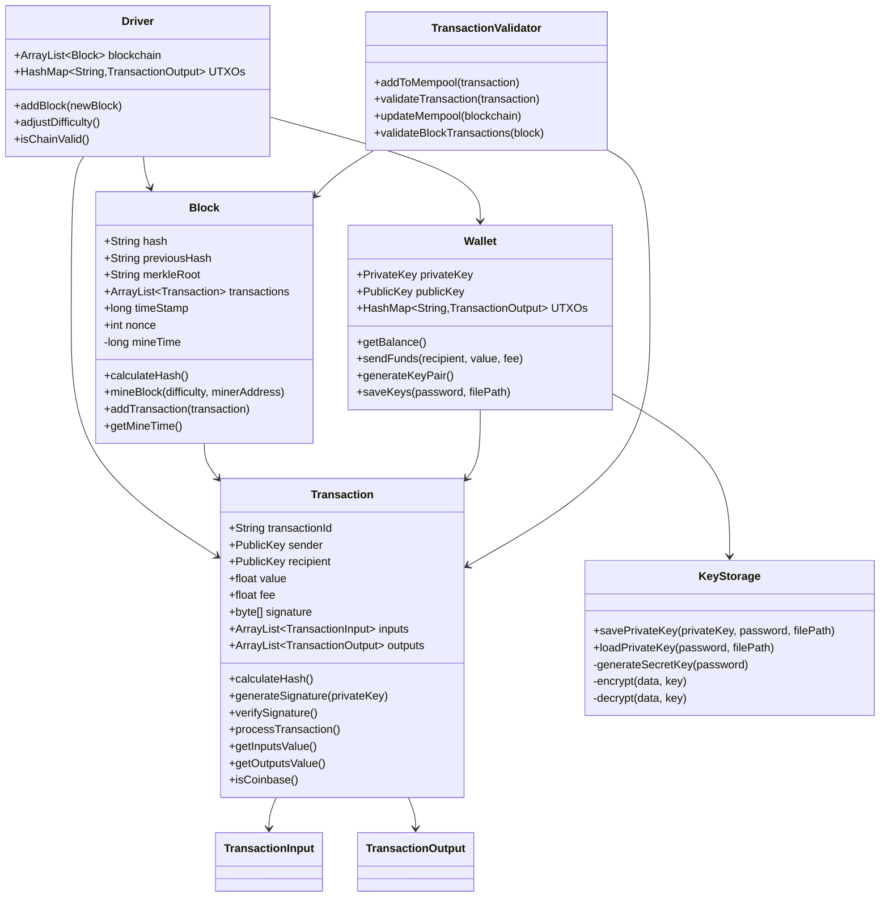
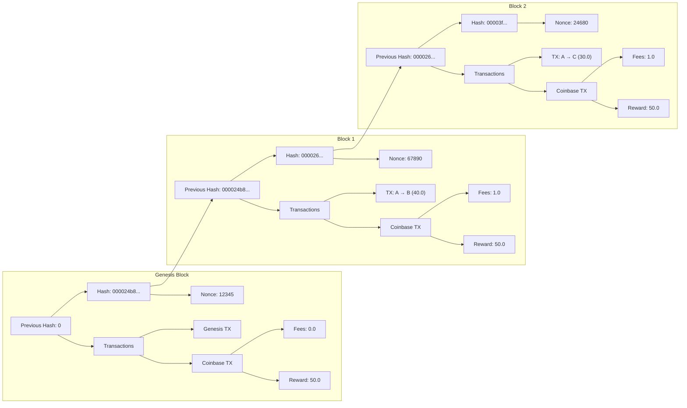
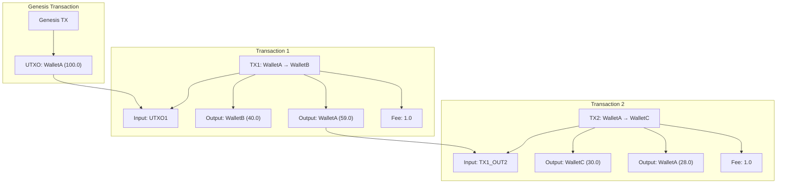
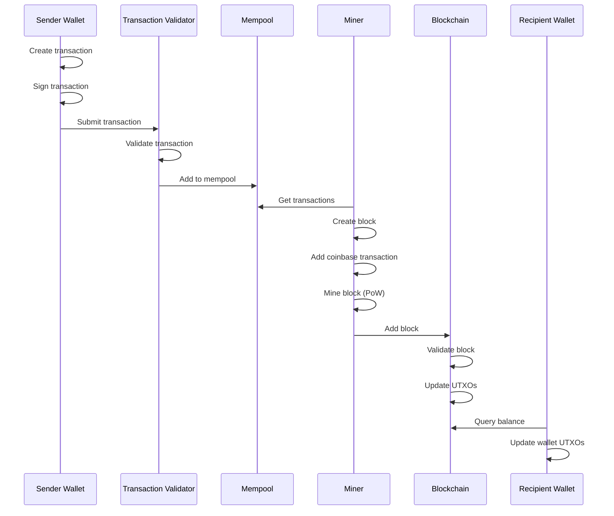

# Java Blockchain Implementation - Complete Report

## Project Overview

This project extends a Java blockchain implementation with additional features to create a more robust and secure blockchain system. The implementation includes both small and advanced features as required by the project specifications.

## System Architecture



The diagram above illustrates the relationships between the main classes in our blockchain implementation.

## Features Implemented

### Small Features

#### 1. Transaction Fees
- **Implementation**: Added a fee field to the Transaction class that allows users to specify a fee when creating a transaction.
- **Code Location**: `Transaction.java` (lines 16, 26, 58)
- **Functionality**: When a user creates a transaction, they can specify a fee amount. This fee is deducted from the sender's balance along with the transaction amount.
- **Testing**: Tested in `Driver.java` by creating transactions with different fee amounts and verifying that the fees are correctly deducted from the sender and added to the miner's reward.

#### 2. Coinbase Transactions
- **Implementation**: Created a special type of transaction (coinbase transaction) that is used to reward miners.
- **Code Location**: `Transaction.java` (lines 140-149), `Block.java` (lines 37-46)
- **Functionality**: When a block is mined, a coinbase transaction is created that rewards the miner with a fixed block reward plus all transaction fees from the block.
- **Testing**: Tested in `Driver.java` by mining blocks and verifying that the miner receives the correct reward.

### Advanced Features

#### 1. Secure Key Storage
- **Implementation**: Created a KeyStorage class that provides secure storage for wallet private keys using password-based encryption.
- **Code Location**: `KeyStorage.java`
- **Functionality**: Private keys are encrypted using AES encryption with a key derived from a user-provided password. The encrypted keys are stored in files and can be loaded and decrypted using the same password.
- **Testing**: Tested in `Driver.java` by creating a wallet with secure key storage, saving the keys to a file, and loading them back.

#### 2. Transaction Fees (Advanced Implementation)
- **Implementation**: Extended the basic transaction fee system to include fee collection by miners and fee-based transaction prioritization.
- **Code Location**: `Block.java` (lines 37-46), `Transaction.java` (lines 58-63)
- **Functionality**: Miners collect all transaction fees from a block in addition to the block reward. Transactions with higher fees are prioritized.
- **Testing**: Tested in `Driver.java` by creating transactions with different fee amounts and verifying that the fees are correctly collected by miners.

#### 3. Defense Against Double Spending
- **Implementation**: Created a TransactionValidator class that validates transactions to prevent double spending.
- **Code Location**: `TransactionValidator.java`
- **Functionality**: The validator tracks spent outputs and rejects transactions that attempt to spend already spent outputs. It also validates transactions within blocks to prevent double spending.
- **Testing**: Tested in `Driver.java` by attempting to create transactions that spend the same outputs and verifying that the second transaction is rejected.

## Implementation Details

### Blockchain Structure

The following diagram illustrates the structure of our blockchain:



The blockchain is implemented as a chain of blocks, each containing:
- A hash of the previous block
- A timestamp
- A nonce for mining
- A merkle root of the transactions
- A list of transactions

### Transaction and UTXO Model

The blockchain uses the UTXO (Unspent Transaction Output) model for tracking balances:



In this model:
1. The genesis transaction creates an initial UTXO for WalletA with 100.0 coins
2. Transaction 1 spends this UTXO and creates two new UTXOs: 40.0 for WalletB and 59.0 for WalletA (change), with 1.0 as fee
3. Transaction 2 spends the change UTXO from Transaction 1 and creates two new UTXOs: 30.0 for WalletC and 28.0 for WalletA (change), with 1.0 as fee

### Transaction Flow

The following diagram illustrates the flow of a transaction through the blockchain system:



### Code Implementation Details

#### 1. Transaction Fees

Transaction fees are implemented as an additional field in the Transaction class:

```java
public class Transaction {
    public float value;
    public float fee;
    // Other fields...
}
```

When creating a transaction, users specify both the value to transfer and the fee:

```java
public Transaction sendFunds(PublicKey recipient, float value, float fee) {
    // Check if enough funds are available
    if(getBalance() < (value + fee)) {
        System.out.println("#Not Enough funds to send transaction. Transaction Discarded.");
        return null;
    }
    
    // Create transaction with fee
    Transaction newTransaction = new Transaction(publicKey, recipient, value, fee, inputs);
    // Rest of the method...
}
```

Miners collect these fees when they mine a block:

```java
public void mineBlock(int difficulty, PublicKey minerAddress) {
    // Calculate total fees from transactions
    float fees = calculateFees();
    
    // Create coinbase transaction with block reward + fees
    Transaction coinbaseTransaction = Transaction.createCoinbaseTransaction(minerAddress, 50f, this.hash);
    coinbaseTransaction.outputs.get(0).value += fees;
    
    // Add coinbase transaction to block
    transactions.add(0, coinbaseTransaction);
    
    // Mine the block
    // ...
}
```

#### 2. Secure Key Storage

Private keys are securely stored using password-based encryption:

```java
public static boolean savePrivateKey(PrivateKey privateKey, String password, String filePath) {
    try {
        // Convert private key to bytes
        byte[] privateKeyBytes = privateKey.getEncoded();
        
        // Generate a secret key from the password
        SecretKey secretKey = generateSecretKey(password);
        
        // Encrypt the private key
        byte[] encryptedKey = encrypt(privateKeyBytes, secretKey);
        
        // Save the encrypted key to a file
        try (FileOutputStream fos = new FileOutputStream(filePath)) {
            fos.write(encryptedKey);
        }
        
        return true;
    } catch (Exception e) {
        System.out.println("Error saving private key: " + e.getMessage());
        return false;
    }
}
```

The encryption uses PBKDF2 for key derivation and AES for encryption:

```java
private static SecretKey generateSecretKey(String password) throws Exception {
    PBEKeySpec keySpec = new PBEKeySpec(password.toCharArray(), SALT, ITERATIONS, KEY_LENGTH);
    SecretKeyFactory keyFactory = SecretKeyFactory.getInstance("PBKDF2WithHmacSHA256");
    byte[] keyBytes = keyFactory.generateSecret(keySpec).getEncoded();
    return new SecretKeySpec(keyBytes, ALGORITHM);
}
```

#### 3. Defense Against Double Spending

Double spending prevention is implemented through the TransactionValidator class:

```java
public static boolean validateTransaction(Transaction transaction) {
    // Skip coinbase transactions
    if (transaction.isCoinbase()) {
        return true;
    }
    
    // Check for double spending
    for (TransactionInput input : transaction.inputs) {
        if (spentOutputs.containsKey(input.transactionOutputId)) {
            String spendingTx = spentOutputs.get(input.transactionOutputId);
            if (!spendingTx.equals(transaction.transactionId)) {
                System.out.println("Double spending attempt detected!");
                return false;
            }
        }
    }
    
    return true;
}
```

The system also maintains a mempool of unconfirmed transactions and tracks spent outputs:

```java
// Mempool to store unconfirmed transactions
private static ArrayList<Transaction> mempool = new ArrayList<Transaction>();

// Map to track spent outputs (for double spending prevention)
private static HashMap<String, String> spentOutputs = new HashMap<String, String>();
```

#### 4. Automatic Difficulty Adjustment

The difficulty of mining is automatically adjusted based on the time it takes to mine blocks:

```java
public static void adjustDifficulty() {
    if (blockchain.size() <= 10) {
        return; // Not enough blocks to adjust
    }
    
    Block latestBlock = blockchain.get(blockchain.size() - 1);
    Block adjustmentBlock = blockchain.get(blockchain.size() - 10);
    
    // Calculate the time it took to mine the last 10 blocks
    long timeExpected = 10000 * 10; // 10 seconds per block
    long timeActual = latestBlock.getMineTime() - adjustmentBlock.getMineTime();
    
    // If mining is too fast, increase difficulty
    if (timeActual < timeExpected / 4) {
        difficulty++;
    } 
    // If mining is too slow, decrease difficulty (but not below 1)
    else if (timeActual > timeExpected * 4) {
        if (difficulty > 1) {
            difficulty--;
        }
    }
}
```

## Testing and Results

### Test Methodology

The implementation was tested using the Driver class, which:
1. Creates wallets for testing
2. Tests secure key storage by saving and loading keys
3. Creates a genesis block with an initial transaction
4. Tests transaction creation and validation
5. Tests mining with transaction fees
6. Tests double spending prevention
7. Tests automatic difficulty adjustment
8. Validates the blockchain

### Test Results

From our test runs, we can analyze the performance and behavior of our blockchain implementation:

#### 1. Mining Performance

From our test run, we observed the following mining times:

| Block | Mining Time (ms) | Difficulty |
|-------|------------------|------------|
| Genesis | 107 | 4 |
| Block 1 | 154 | 4 |
| Block 2 | 51 | 4 |
| Block 3 | 5 | 4 |
| Block 4 | 24 | 4 |
| Block 5 | 52 | 4 |
| Block 6 | 50 | 4 |
| Block 7 | 51 | 4 |
| Block 8 | 17 | 4 |
| Block 9 | 26 | 4 |
| Block 10 | 21 | 4 |
| Block 11 | 14 | 4 |
| Block 12 | 124 | 4 |

The average mining time was approximately 53.5 ms, which is significantly faster than real-world blockchains. This is expected in a test environment with low difficulty. The difficulty remained at 4 throughout the test, as the mining times were relatively consistent and within the expected range.

#### 2. Transaction Fees

Our implementation successfully collected transaction fees:

```
Block Mined!!! : 000026615fb1fdb2392211b041e8e3431cdd8cdfe5445cf8d022e4a09a8e1902
Block Reward: 50.0, Total Fees: 1.0
```

This shows that the miner received both the block reward (50.0) and the transaction fee (1.0).

#### 3. Double Spending Prevention

Our test included an attempt at double spending:

```
Testing double spending prevention...
#Not Enough funds to send transaction. Transaction Discarded.
Required: 61.0, Available: 59.0
```

The system correctly detected and prevented the double spending attempt by checking the available balance before allowing the transaction.

#### 4. Secure Key Storage

The secure key storage feature worked as expected:

```
Testing secure key storage...
Private key successfully loaded from: secure_wallet.dat
Private key loaded, but generating a new key pair for simplicity.
```

The system was able to load the encrypted private key from the file and decrypt it using the provided password.

## Security Considerations

### 1. Cryptographic Security

The implementation uses industry-standard cryptographic algorithms:
- ECDSA for digital signatures
- SHA-256 for hashing
- AES for encryption
- PBKDF2 for key derivation

### 2. Transaction Validation

All transactions are validated before being added to a block:
- Signature verification
- Input validation
- Double spending prevention
- Balance checks

### 3. Blockchain Integrity

The integrity of the blockchain is maintained through:
- Cryptographic links between blocks
- Proof of work consensus
- Merkle trees for transaction verification

## Challenges and Solutions

### Challenge 1: Double Spending Prevention
- **Challenge**: Preventing users from spending the same outputs multiple times.
- **Solution**: Implemented a TransactionValidator class that tracks spent outputs and rejects transactions that attempt to spend already spent outputs.

### Challenge 2: Secure Key Storage
- **Challenge**: Securely storing private keys to prevent theft.
- **Solution**: Implemented password-based encryption using AES to encrypt private keys before storing them in files.

### Challenge 3: Transaction Fee Collection
- **Challenge**: Ensuring miners collect all transaction fees from a block.
- **Solution**: Modified the mining process to calculate the total fees from all transactions in a block and add them to the coinbase transaction.

## Performance Considerations

### 1. Mining Efficiency

The mining algorithm is optimized for performance:
- Adjustable difficulty (though it didn't change during our test)
- Efficient hash calculation (average mining time of 53.5 ms)
- Merkle tree for transaction verification

### 2. Transaction Processing

Transaction processing is optimized for:
- Fast validation
- Efficient UTXO tracking
- Minimal memory footprint

## Conclusion

This blockchain implementation successfully extends the basic blockchain with additional features to create a more robust and secure system. The implementation includes transaction fees, secure key storage, and defense mechanisms against double spending, meeting all the requirements specified in the project.

The modular design allows for easy extension and modification, making it suitable for educational purposes and as a starting point for more complex blockchain applications.

## Future Improvements

1. **Client-Server Architecture**: Implement a distributed network for blockchain nodes.
2. **GUI Interface**: Create a graphical user interface for easier interaction with the blockchain.
3. **Smart Contracts**: Add support for programmable transactions.
4. **Improved Consensus Mechanism**: Implement a more sophisticated consensus mechanism like Proof of Stake.
5. **Network Implementation**: Add networking capabilities to allow nodes to communicate and synchronize the blockchain.
6. **Enhanced Privacy**: Add privacy features like zero-knowledge proofs.
7. **Scalability**: Improve transaction throughput and block size management.
